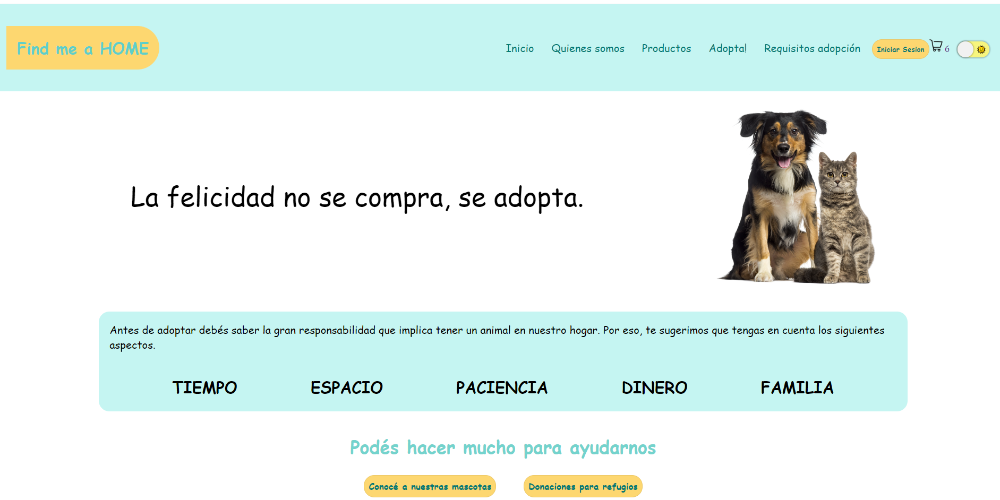

# Grupal Project

## Find me a home

Collaborator as part of a team in the development of a website that is dedicated to the adoption of pets, also has an e-commerce where you can buy items for pets. In addition, donations can be made to the shelters that are logged in on the page.

The functionalities that the application has:

- Buy pet products through a payment gateway
- Select pets to adopt
- Donate to Registered Shelters
- Add products to cart

Technologies:

- Database: PostgresSQL - Sequelize
- Backend: Nodejs - Express
- Front-end: React - Redux - CSS

We also implement other technologies such as Nodemailer and Cloudinary.

<a href="https://proyecto-final-carolinambb.vercel.app/">Deploy link!</a>
